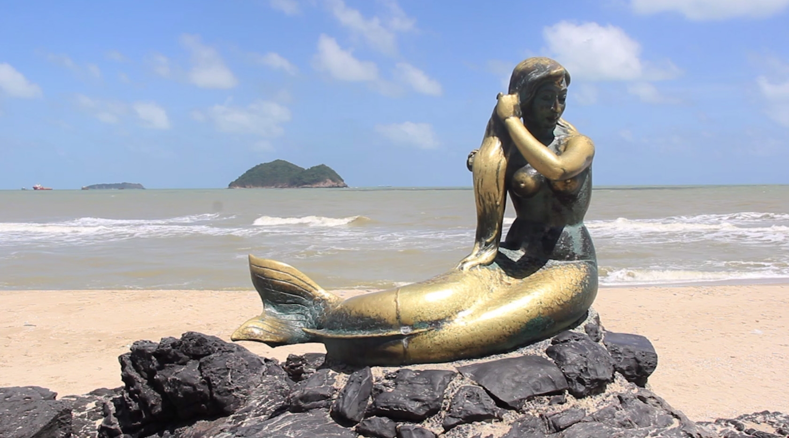

## หาดสมิหลา

สถานที่ท่องเที่ยวสำคัญที่มีชื่อเสียงของสงขลา อยู่ในเขตเทศบาลเมือง หาดสมิหลามีโขดหินขนาดย่อมยื่นลงทะเล หาดทรายขาวละเอียดมากที่เรียกว่า "ทรายแก้ว" มีป่าสนร่มรื่น จากหาดสมิหลาสามารถมองเห็นทิวทัศน์อันงดงามของ เกาะหนูเกาะแมว จนมีคำกล่าวว่าใครมาเยือนสงขลาแล้วไม่มาเยือนสมิหลาก็เหมือนมาไม่ถึงสงขลา มีสัญลักษณ์ที่มีชื่อเสียงรูปปั้น นางเงือกทอง โดยรอบบริเวณได้จัดสวนหย่อม ไว้ดูร่มรื่นเหมาะเป็นที่นั่งพักผ่อนยามเย็น เมี่อมองออกไปในทะเลจะเห็น เกาะหนู เกาะแมวอันเป็นอีกสัญลักษณ์หนึ่ง หาดสมิหลาเป็นชายหาดที่มีบรรยากาศสงบ เหมาะสำหรับมาพักผ่อนชมวิว มีชายหาดต่อเนื่อง กัน เรียกว่าแหลมสนอ่อน อยู่เลยหาดสมิหลาไปทางตะวันตก ช่วงของแหลมสนอ่อนจะยาวไปจนถึงสันเขื่อนในทะเล

## นิยายนางเงือกทอง

นางเงือกทอง เป็นเรื่องในนิยายปรัมปราของไทยโบราณ ซึ่งขุนวิจิตรมาตรา (สง่า กาญจนาคพันธ์) เป็นผู้เล่าไว้ ในวันดีคืนดี นางเงือกจะมานั่งหวีผมบนชายหาดด้วยหวีทองคำ กระทั่งวันหนึ่งมีชายชาวประมง เดินผ่านมาทำให้นางเงือกตกใจ รีบหนี ลงทะเล ไปโดยลืมหวีทองคำไว้ ชาวประมงเห็นดังนั้น ก็เก็บหวีทองคำไว้และเฝ้าคอยนางเงือกที่หาดนั้นเสมอ แต่นางเงือกก็ไม่เคยปรากฏ กายให้เห็นอีกเลย สำหรับ “นางเงือกทอง” ถูกสร้างขึ้นในปี พ.ศ. 2509 ในท่านั่งหวีผม หล่อขึ้นด้วยบรอนซ์รมดำ โดยฝีมือการออก แบบ ปั้น และหล่อ โดยอาจารย์จิตร บัวบุศย์ ด้วยเงิน 60,000 บาท(ในสมัยนั้น) โดยใช้เงินจากงบประมาณของเทศบาลสงขลา

<!---
## Blockquotes

> Meo locum plurimus laudatos exstantibus fistula nocte Ancaeo denique montanum.
> Dissipat nullique tenax; aut una lacessit purpureus sumptis inlaesos,
> Polypemonis quisque blanditus. Obscenas rumpitque numerum effluxere,
> pronusque: Mygdonidesque precantia erat potes undis. Resurgere conplet velut
> freta miram enim, maiorque nec nec inaniter mensura et ipse artus flebam
> gentisque solus.

## Ordered List

1. Quotiens urbis Charaxi referre
2. Terris acti iussit extrema
3. Vel totis Iove locum forma
4. Esse neve illi crimen ripis et crimina

## Unordered List

- Quotiens urbis Charaxi referre
  - freta miram enim
  - freta miram enim
    - maiorque nec nec
    - maiorque nec nec
    - maiorque nec nec
- Terris acti iussit extrema
- Vel totis Iove locum forma
- Esse neve illi crimen ripis et crimina

## Table
 
| Tables   |      Are      |  Cool |
|----------|:-------------:|------:|
| col 1 is |  left-aligned | $1600 |
| col 2 is |    centered   |   $12 |
| col 3 is | right-aligned |    $1 |

## Codeblock

Here a sample text which contains `<?php echo 'inline code'; ?>` and also code blocks.

```js
function visitor(node) {

  try {
    const alignment = node.align;

    visit(node, 'tableRow', (rowNode) => {
      rowNode.children.forEach(function (cellNode, index) {
        cellNode.align = alignment[index]
      });
    });

    node.align = node.align.map(function(value) {
      return null;
    });
    
  } catch (e) {
  }
}
```
--->
## รูปภาพ

