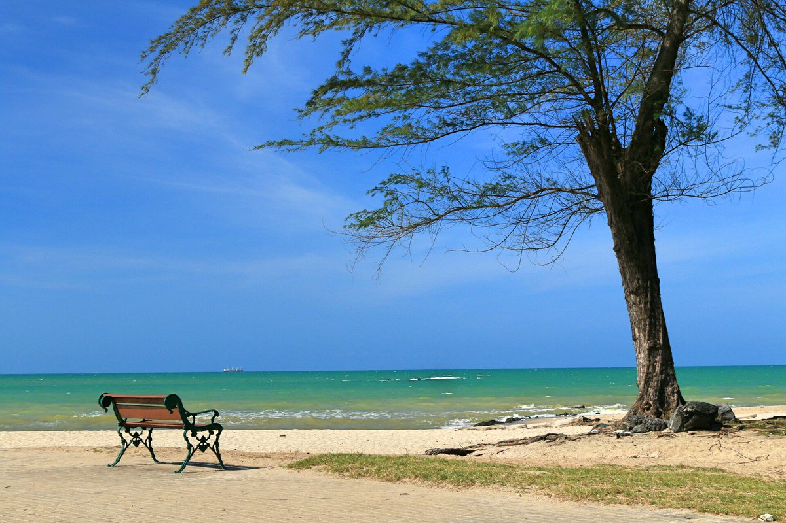

<!--- featured: true --->

## หาดชลาทัศน์

หาดชลาทัศน์ เป็นชายหาดที่ยาวต่อเนื่องมาจากหาดสมิหลา  ลักษณะของหาดค่อนข้างเป็นเส้นตรง มีถนนชลาทัศน์เลียบแนวชายหาดและมีแนวต้นสนให้ความร่มรื่นยาวตลอดหาด เนื่องจากหาดหันไปทางด้านทิศตะวันออกเฉียงเหนือ ในช่วงเช้าจึงพอจะใช้เป็นที่ชมพระอาทิตย์ขึ้นได้ด้วย  จุดที่น่าสนใจของหาดชลาทัศน์ คือ ช่วงกลางของหาดมีเวทีประชาชนเทศบาลนครสงขลา เป็นสวนสาธารณะที่พักผ่อนหย่อนใจโดยการสร้างสนามเด็กเล่นระหว่างแนวต้นสน เป็นสถานที่ฝึกซ้อมวอลเลย์บอลชายชายหาดของนักกีฬา ช่วงเช้าและเย็นมีประชาชนมาปั่นจักรยานบนถนน ด้านทิศเหนือสุดแนวหาดเชื่อมต่อกับแหลมสมิหลามีวงเวียนรูปปั้นคนอ่านหนังสือเพื่อให้คนไทยรักการอ่าน

## รูปภาพ

