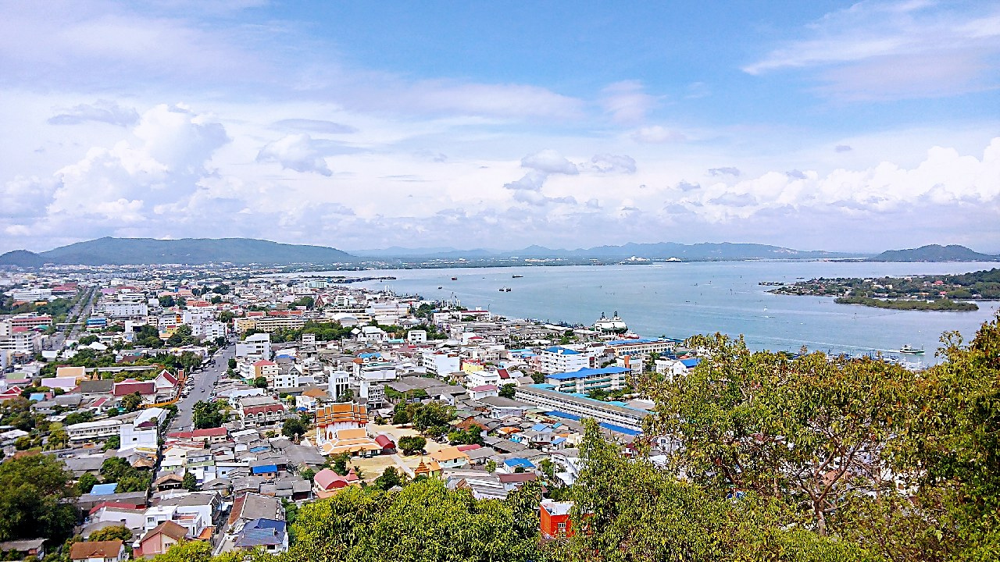

## เขาตังกวน

เป็นสถานที่ท่องเที่ยวที่สำคัญแห่งหนึ่งในอ.เมือง จ.สงขลา   เป็นเนินเขาสูง จากระดับน้ำทะเลประมาณ 2,000 ฟุต จากยอดเขาตังกวนนี้สามารถมองเห็นทิวทัศน์ของเมืองสงขลาได้โดยรอบ บนยอดเขาตังกวนเป็นที่ประดิษฐานเจดีย์พระธาตุคู่เมือง สงขลาซึ่งสร้างในสมัยอาณาจักรนครศรีธรรมราช เป็นศิลปะสมัยทวาราวดี(อยู่บนยอดเขาสูงจากระดับน้ำทะเลประมาณ 2,000 ฟุต ) โดยพระบาทสมเด็จพระจอมเกล้าเจ้าอยู่หัว (ร.4) ได้พระราชทานเงินหลวงให้เป็นทุนในการบูรณะปฏิสังขรณ์ และในเดือนธันวาคม พ.ศ. 2539 พระบาทสมเด็จพระเจ้าอยู่หัวรัชกาลปัจจุบัน (ร.9) ได้ทรงพระราชทานพระบรมสารีริกธาตุให้มาบรรจุในองค์พระเจดีย์ในทุกๆ ปีในเดือนตุลาคม จะมีงานพิธีห่มผ้าองค์พระเจดีย์ และประเพณีตักบาตรเทโวและลากพระของสงขลา

## เจดีย์พระธาตุ

พระเจดีย์หลวงเป็นอีกหนึ่งในโบราณสถานที่สำคัญของเขาตังกวน พระเจดีย์ก่ออิฐถือปูนทรงระฆัง สันนิษฐานว่าเป็น พระเจดีย์โบราณที่มีมานาน แต่ไม่ปรากฎหลักฐานความเป็นมาที่ชัดเจน จนต่อมาในปี พ.ศ.2402 พระบาทสมเด็จพระจอมเกล้าเจ้า อยู่หัวฯ เสด็จพระราชดำเนินประพาสเมืองสงขลา หลังจากนั้นในปี พ.ศ.2409 จึงได้โปรดเกล้าฯ พระราชทานเงินหลวง 37 ชั่ง ให้เจ้าพระยาวิเชียรคีรี (เม่น) ทำการบูรณะปฏิสังขรณ์พระเจดีย์ให้สูงใหญ่กว่าของเก่า และในครั้งนั้น เจ้าพระยาวิเชียรคีรี (เม่น)ได้ สร้างคฤห์ไว้ที่ฐานพระเจดีย์ และต่อเติมเก๋งที่มุมกำแพง พระเจดีย์หลวงเป็นพระเจดีย์คู่บ้านคู่เมือง ของสงขลาจึงมีการบูรณะซ่อม แซมมาโดยตลอด ในปีพ.ศ. 2539 พระบาทสมเด็จพระเจ้าอยู่หัวฯ ทรงพระราชกรุณาโปรดเกล้าพระราชทาน พระบรมสารีริกธาตุ และเครื่องสักการะบูชาประดิษฐานไว้ ณ พระเจดีย์หลวง เพื่อไว้เป็นที่สักการะบูชาของชาวเมืองสงขลาสืบต่อไป

## รูปภาพ

