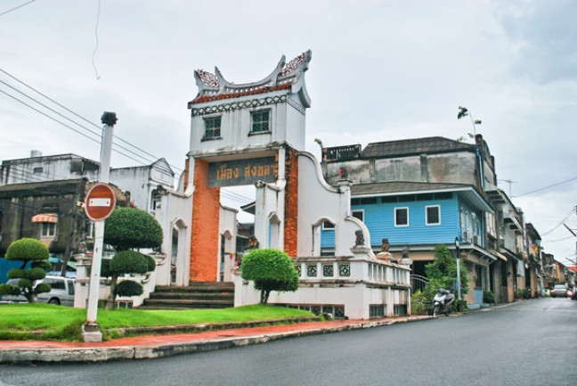

<!--- featured: true --->

## ย่านเมืองเก่าสงขลา

ตั้งอยู่ในเขตอำเภอเมือง มีถนนสายสำคัญน่าเดินเที่ยว 3 สาย คือ ถนนนครนอก ถนนนครใน และ ถนนนางงาม ย่านการค้าที่สำคัญในอดีตของเมืองสงขลา เป็นถนนที่ประกอบไปด้วยอาคารและสถาปัตยกรรมที่งดงามที่ยังคงเอกลักษณ์ดั้งเดิมเอาไว้  ตั้งเรียงรายต่อเนื่องกันไปตามถนน แทรกตัวไปพร้อมกับธุรกิจสมัยใหม่ ทั้งร้านอาหารดั้งเดิม ผสมกับร้านอาหารฟิวชั่น  แถมมีการเพิ่มสีสันด้วยภาพวาดสตรีทอาร์ท สุดน่ารักตามผนังอาคารบ้านเรือนต่างๆ ที่สะท้อนเรื่องราววิถีชีวิตและวัฒนธรรมของคนสงขลา ทำให้การเดินเที่ยวชมย่านเมืองเก่าสงขลาไม่ได้เพียงแต่จะได้ชมความงามของตึกโบราณเหล่านี้ แต่ยังได้สนุกสนานไปกับการถ่ายภาพโพสต์ท่ากับภาพวาดต่างๆด้วย

## รูปภาพ

