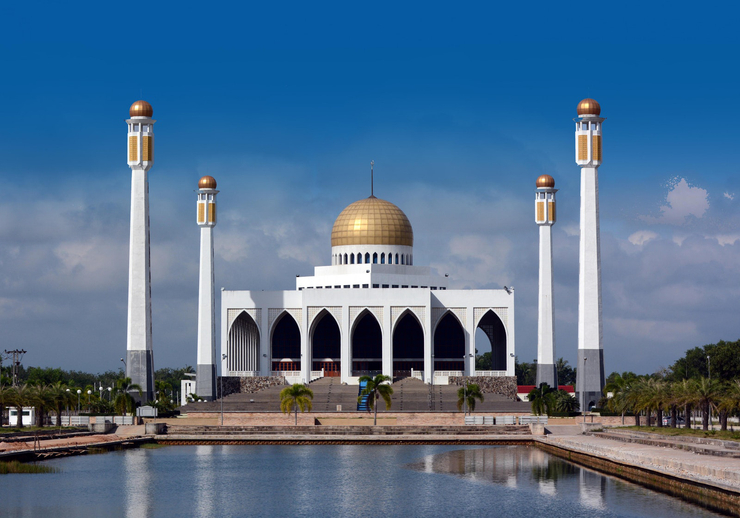

## มัสยิดกลางสงขลา

ตั้งอยู่ที่ ถนนลพบุรีราเมศวร์  ตำบลคลองแห อำเภอ หาดใหญ่ จังหวัด สงขลา เป็นศาสนสถาน เป็นสถานที่ท่องเที่ยว และศูนย์รวมจิตใจของชาวมุสลิม ในสงขลา ต้องบอกว่าที่นี่เป็น มัสยิดที่ใหญ่และอลังการมาก มัสยิด กลางแห่งนี้โดดเด่นจนสามารถมองเห็นได้อย่างชัดเจน ตั้งแต่อยู่บนภูเขาใน สวนสาธารณะหาดใหญ่กันเลยทีเดียว หากใครได้มาจังหวัดสงขลาแล้ว ต้องไม่พลาดที่จะมาชมความงดงามของ มัสยิดกลางแห่งนี้  มัสยิดแห่งนี้ได้รับการขนานนามว่า ” ทัชมาฮาลเมืองไทย ” ยิ่งมาในช่วงเวลาเย็นไปถึงช่วงค่ำ มัสยิดเปิดไฟสว่างมีฉากหลังของ ท้องฟ้าเปลี่ยนสีในยามเย็นงดงามยิ่งนัก

## รูปภาพ

