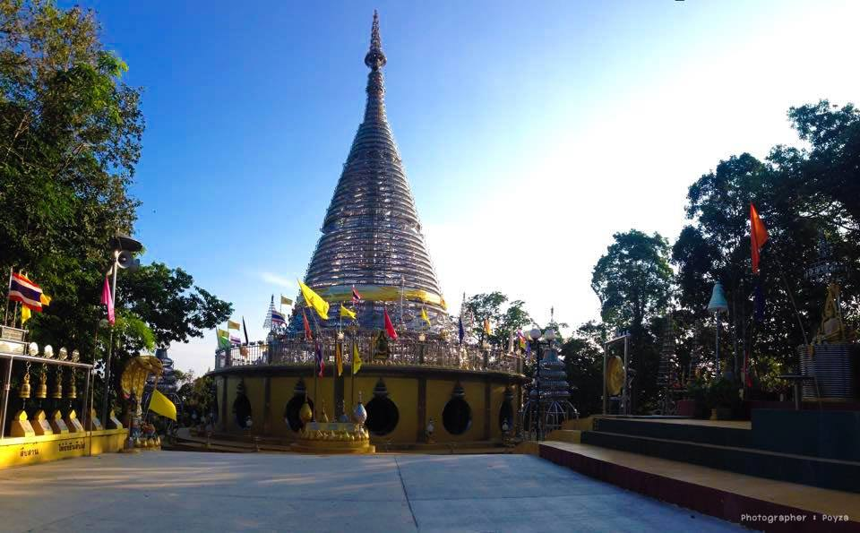

<!--- featured: true --->

## พระมหาเจดีย์ไตรภพ ไตรมงคล

วัดพระมหาเจดีย์ไตรภพไตรมงคล หรือ เจดีย์สแตนเลส ตั้งอยู่ในอำเภอหาดใหญ่ จังหวัดสงขลา ตั้งเด่นเป็นสง่าอยู่บนเขาคอหงส์ หลังม.สงขลานครินท์  โดยองค์พระเจดีย์มีความงดงามและแปลกตาโดยโครงเหล็กทุกชิ้นเป็นสแตนเลสทั้งหมด เรียกได้ว่าเป็น เจดีย์สแตนเลสหนึ่งเดียวในโลก พระมหาธาตุเจดีย์ไตรภไตรมงคล สร้างขึ้นเพื่อน้อมถวายเป็นพระราชกุศลแด่พระบาทสมเด็จพระปรมินทมหาภูมิพลอดุลยเดช เนื่องในวโรกาสทรงครองสิริราชสมบัติ 60 ปี อีกทั้งยังสร้างเพื่อเป็นศูนย์รวมใจสืบสานพระพุทธศาสนาขนบธรรมเนียมและวัฒนธรรม ประเพณีไทย การเผยแพร่พุทธประวัติและพุทธจริยวัตรสมเด็จพระสัมมาสัมพุทธเจ้า

## รูปภาพ

